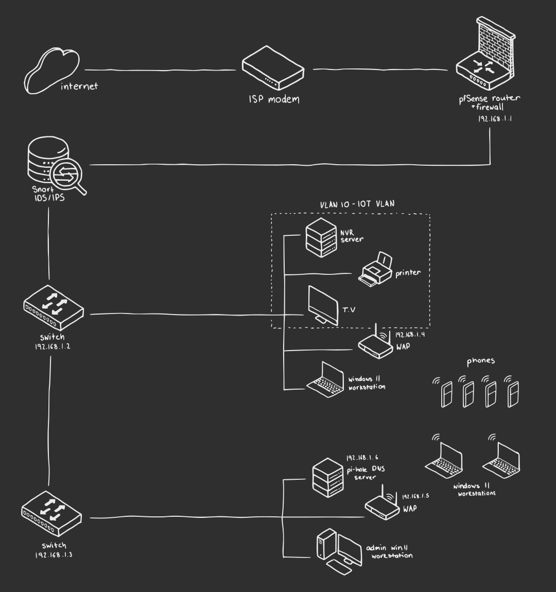
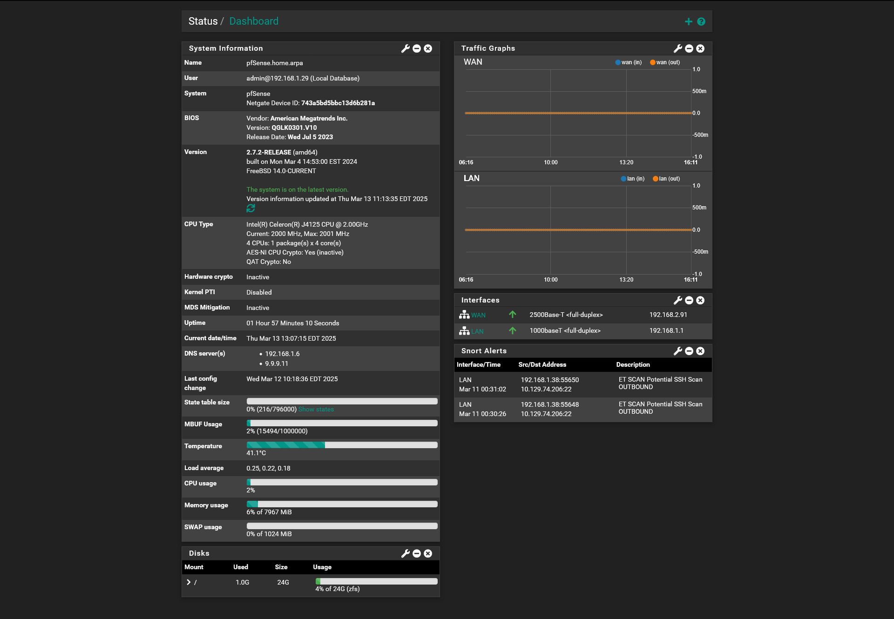
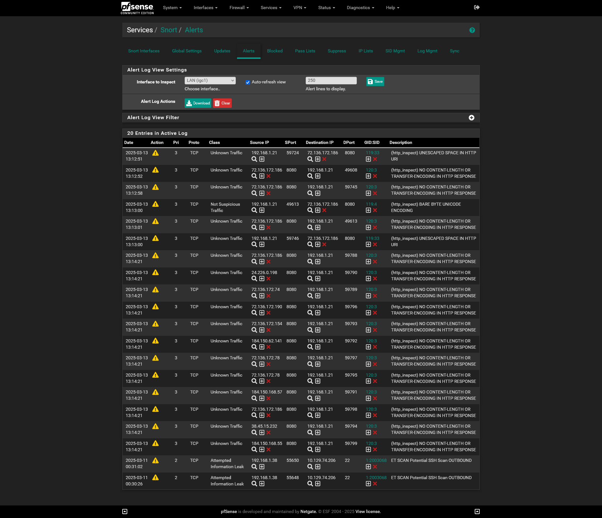
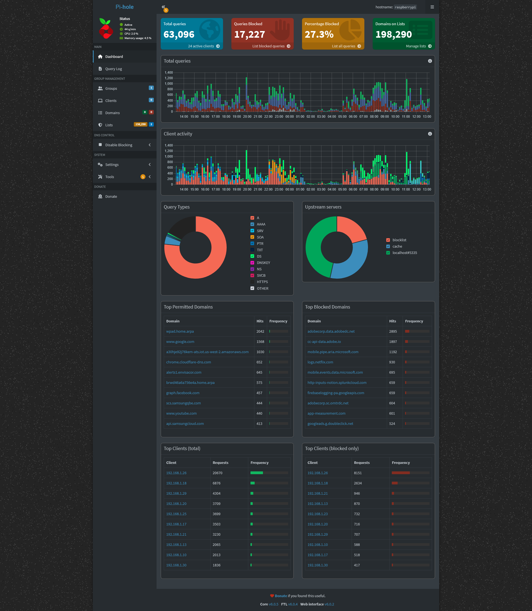

Design a secure, performant, and scalable home network that simulates a small-scale enterprise network using robust open-source technologies. Ensure compliancy with fundamental security frameworks to secure against threat vectors. Continuously optimize the network to ensure high-availability, security, and scale-up to meet growing needs.    

# Network Overview

### Topology

The network uses a **star topology** where all devices connect to a central router. This configuration was chosen for its simplicity, scalability, and ease of administration. In this topology:

- The central router is responsible for managing network traffic.
- Two managed switches are employed to expand wired connectivity, ensuring robust and efficient performance.
- Wireless connectivity is provided by two routers, configured as mesh wireless access points (WAPs) to ensure high-speed coverage and seamless roaming.

### IP Addressing Scheme

A hybrid IP addressing scheme is implemented, with:

- **Static IPs** for critical infrastructure like the router, switches, and key network servers.
- **Dynamic IPs (DHCP)** for less critical devices like personal computers, IoT devices, and other peripherals, offering flexibility and ease of management.

### Infrastructure

- **pfSense Router**:
    - Acts as the core router, firewall, and VPN gateway.
    - pfSense is open-source and allows for robust network security features, including traffic filtering, logging, and more.
- **Managed Switches**:
    - Two interlinked switches improve network performance, reliability, and security.
    - Enable **VLANs** for network segmentation, ensuring isolation of traffic based on device types or functions (e.g., separating IoT devices from critical systems).
- **Wireless Access Points**:
    - The wireless network is extended by using mesh network configurations that ensure stable, high-speed Wi-Fi coverage across the house.    

# Security Implementations

### **VLAN Segmentation and Firewall Rules**

Network segmentation with VLANs (Virtual Local Area Networks) is utilized to isolate traffic based on the roles of devices:

- **IoT Devices VLAN**: This segmentation ensures IoT devices with weaker security do not have access to critical infrastructure.
- **Firewall Rules**: pfSense’s firewall controls the traffic between VLANs, ensuring that only authorized communication occurs between segments.

### Snort IDS/IPS

**Snort**, an open-source Intrusion Detection and Prevention System (IDS/IPS), is implemented to detect and prevent malicious activities on the network. The configuration includes:

- **Real-time detection** of common threats, such as port scans, buffer overflow attempts, and suspicious login patterns.
- Customizable rule sets tailored to common home network ports (HTTP, HTTPS, DNS) for efficient monitoring.
- Disabling of rules that are specific to larger-scale enterprise environments (e.g., server infrastructure) to optimize performance.

### Pi-Hole DNS

**Pi-Hole** was deployed as a network-wide ad blocker, acting as a DNS sinkhole to block unwanted content such as ads, trackers, and malware at the network level. Configured Pi-Hole blocklists to enhance security while avoiding false positives and increased overhead. Setup **Unbound**, a recursive DNS resolver that works in conjunction Pi-Hole to ensure that DNS queries are resolved locally, bypassing third-party DNS servers, which reduces exposure to potential tracking or data leakage. This setup enhances Pi-Hole’s ad-blocking capabilities, improves performance with faster response times, and strengthens privacy by encrypting DNS queries (via DNS over HTTPS or DNS over TLS)

    

# Security Principles

### **Secure by Design**

The network is built with security in mind from the outset. Every component, from pfSense to Pi-Hole, was chosen and configured with security best practices to minimize vulnerabilities. Segmentation of devices ensures that even if one area is compromised, the impact is limited.

### **Defense in Depth**

Multiple layers of defense are employed to protect against various threats:

- pfSense acts as a firewall, blocking unauthorized inbound and outbound traffic.
- Snort provides real-time monitoring and prevention of malicious activity.
- Pi-Hole helps block ad and malware traffic, reducing exposure to external threats.

### **Separation of Duties**

Different network devices and services are assigned specific roles:

- pfSense handles routing, firewalling, and VPN connections.
- Managed switches focus on improving network performance, while mesh access points handle wireless traffic.
- VLAN segmentation ensures that critical systems are isolated from potentially insecure devices.    

# Key Takeaways

This project successfully designed and implemented a secure, performant, and scalable home network using open-source technologies. By focusing on security frameworks like Snort, Pi-Hole, and network segmentation, the system effectively mitigates potential threats and ensures that all devices are securely isolated based on their role within the network. With future integrations like Active Directory, Splunk, and TheHive, this home network will continue to evolve to meet the growing security needs of the modern digital landscape.