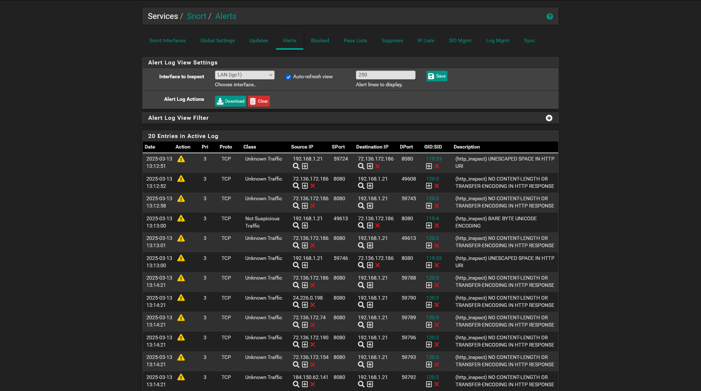

Implement a Snort IDS/IPS solution within a home network using pfSense to enhance security and monitor network traffic for potential threats. Configure and fine-tune Snort for optimal performance and accuracy, ensuring real-time detection and prevention of malicious activity. Maintain ongoing updates and adjustments to keep the system effective against evolving security risks while minimizing false positives.    

# Snort Overview

Snort is an open-source IDS/IPS that analyzes network traffic in real-time to detect and prevent malicious activity. It logs potential threats, allowing for proactive responses, and can actively block harmful traffic. Snort protects against a range of attacks, including malware and unauthorized access, reducing the risk of data breaches and enhancing network security. 

# Install 
Installed Snort through pfSense's Package Manager and configured it to run real-time detection and prevention on the LAN interface.

Configuring Snort on the LAN interface helps detect internal threats like malware or unauthorized access. On a WAN interface, Snort would generate more false positives due to the high volume of benign external traffic, such as scans or bots. This increases alerts and network overhead, reducing performance and efficiency. 

# Configuring Rules
I’ve configured Snort with the following rules:

   - **Network-based signature rules**:  
  Focused on high-risk services like HTTP and SMB, targeting known attack patterns while minimizing overhead.
- **Anomaly-based rules**:  
  Detect unusual traffic patterns (e.g., traffic spikes) to identify potential attacks without generating false positives.
- **ICMP and port scan detection**:  
  Block common threats like DDoS and scanning attempts.
- **Application layer rules**:  
  Monitor web protocols (HTTP, DNS) for attacks like SQL injection and XSS.
- **Logging and alerting thresholds**:  
  Set to log suspicious events and generate alerts, ensuring precise detection without overwhelming the system.    

# Challenges

### False Positives
When I first set up Snort, I was overwhelmed by false positives, which made it difficult to distinguish between actual threats and harmless traffic. The default ruleset was too broad, generating a high volume of alerts for common traffic patterns that weren’t malicious at all, adding to the noise.

To address this, I began by narrowing the ruleset to focus on higher-risk services and traffic I knew was more likely to be targeted by attackers. In addition, I implemented pass lists to filter out known legitimate traffic, ensuring that it wouldn't trigger unnecessary alerts. I also took advantage of Snort’s thresholding feature to suppress repetitive alerts for benign traffic, gradually adjusting the thresholds to strike the right balance. This process involved some trial and error, but in the end, it helped reduce false positives and made Snort more manageable without sacrificing its ability to effectively detect genuine threats.

### Network Traffic Overhead 
Initially, I noticed Snort was causing lag on my network, especially during peak traffic periods. This was due to the strain of real-time packet inspection on my pfSense setup's limited resources.

To improve performance, I optimized Snort by configuring it to monitor only the LAN interface, which reduced the load from the high volume of external traffic on the WAN side. I also adjusted the logging level, cutting down on unnecessary details while still capturing critical alerts. These changes resulted in only an 8% increase in CPU usage and a 21% increase in RAM usage, allowing Snort to run more efficiently without disrupting network responsiveness.    

# Conclusion
In conclusion, implementing Snort as an IDS/IPS solution with pfSense significantly enhanced my home network security by providing real-time threat detection and prevention. Through careful configuration, I reduced false positives, optimized performance, and maintained effective threat detection. By focusing on high-risk services, using pass lists, and adjusting logging settings, I minimized unnecessary alerts while ensuring accuracy. Optimizing Snort for the LAN interface and adjusting system settings helped balance security with network performance. Moving forward, ongoing updates will be crucial to keep the system effective against emerging threats.
